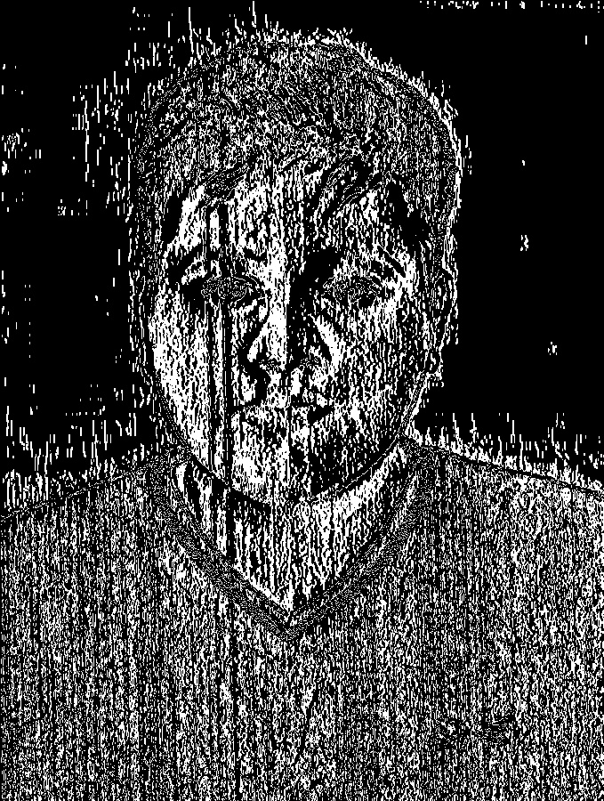

# Assignment 1

Original Image  

GrayScale Image  
**Algorithm**  
g(x,y)=(B(x,y)+G(x,y)+R(x,y)) / 3  
img.png

Edge detection using sobel operator  
**Algorithm**  
Sobel Operators  

Image sub matrix  

<table class="tg">

<thead>

<tr>

<th class="tg-0pky">-1,-1</th>

<th class="tg-0pky">0,-1</th>

<th class="tg-0pky">1,-1</th>

</tr>

</thead>

<tbody>

<tr>

<td class="tg-0pky">-1,0</td>

<td class="tg-0pky">0,0</td>

<td class="tg-0pky">1,0</td>

</tr>

<tr>

<td class="tg-0pky">-1,1</td>

<td class="tg-0pky">0,1</td>

<td class="tg-0pky">1,1</td>

</tr>

</tbody>

</table>

1.  Pad image by one pixel on all edges
2.  For every pixel in image, extract sub matrix as shown above and perform matrix multiplication with sobel operators. Sum all the elements and assign it to the new image at corresponding pixel.
3.  Calculate average of the outputs generated by matrix multiplication to combine horizontal and vertical edge detection
4.  Perform thresholding and generate binary image

